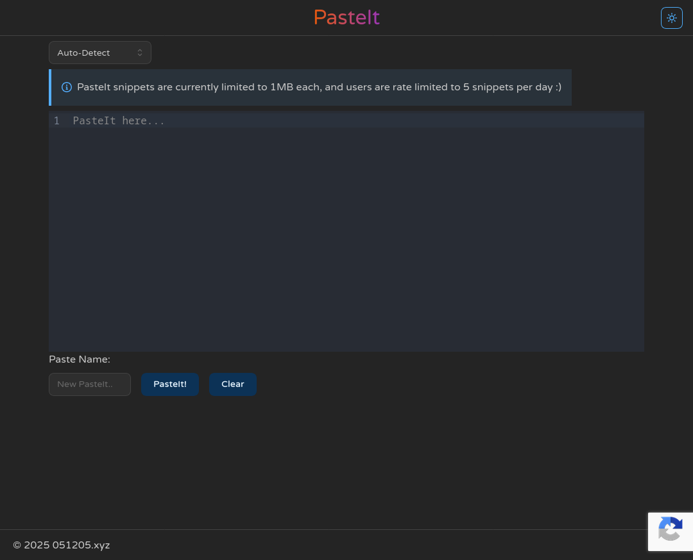
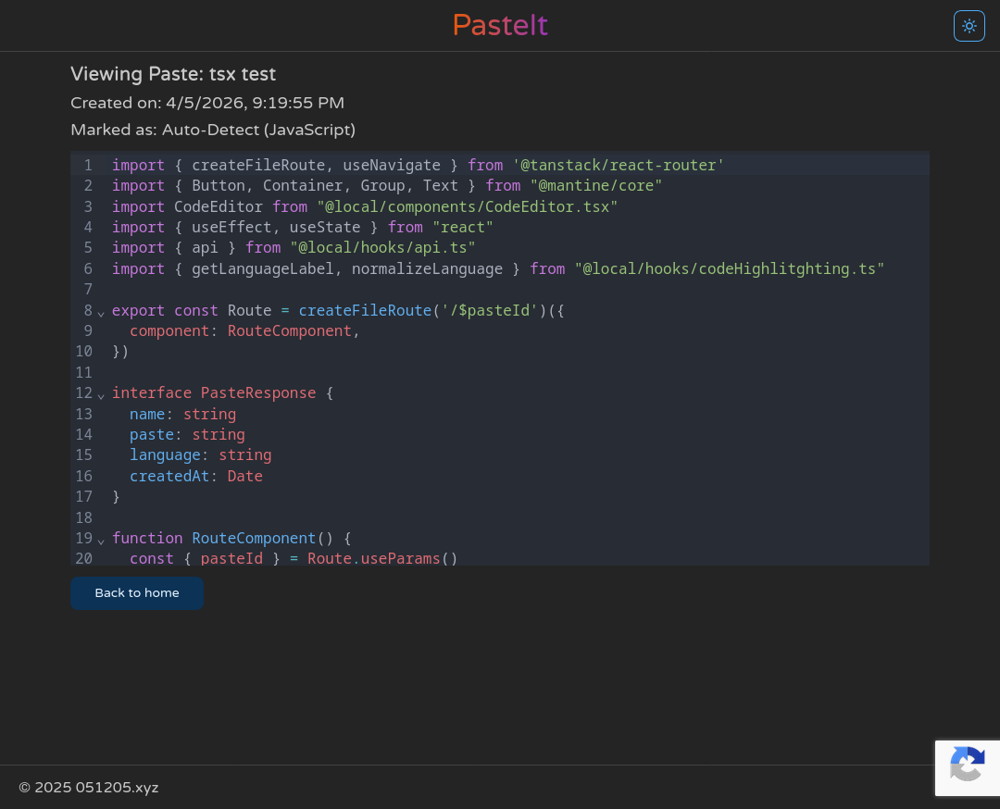

# PasteIt 📋
A lightweight, self-hosted pastebin-like service built with Rust for fast and secure text sharing.

## Screenshots (click to expand)

Home page

  
Paste view

  

## Features
- Syntax highlighting through [codemirror](https://codemirror.net/)
- Rate limiting by IP address
  - Note: IPs are saved in the database using SHA256 hashing for added privacy
- Database paste storage encrypted with AES-256
- reCAPTCHA protected upload

Planned:
- Expiry time for pastes
- Password protected pastes
- API support for raw data fetching (Already partially functional)

## API Endpoints
>[!Note]
> You can visit /api/docs for OpenAPI documentation and testing of the API endpoints.

Creating new pastes:
- Call `POST /api/pastes/paste` which accepts these arguments
  - `name: Option<String> | string`
  - `paste: String | string`
  - `language: String | string`
  - `recaptchaToken: Option<String> | string | undefined` (required only when reCAPTCHA is enabled)

Getting pastes:
- Call `GET /api/pastes/paste/{short_id}` which will return this in its content
  - `name: String | string`
  - `paste: String | string`
  - `language: String | string`
  - `createdAt: DateTime<UTC> | Date`

## Configuration
- DB_URL - URL string to connect to your database of choice (postgres for best compatibility. other databases may work but are not tested)
- PASTE_ENCRYPTION_KEY - String used to encrypt paste content. `openssl rand -hex 32` or equivalents are recommended
- RECAPTCHA_SECRET_KEY - optional backend secret key (enables server-side reCAPTCHA verification)
- VITE_RECAPTCHA_SITE_KEY - optional frontend site key (loads and executes reCAPTCHA in the client)
>[!Note]
> The default port for the backend is 4000 and can be changed [here](src/server/main.rs#L62) if needed.
> Remember to also update the vite proxy and docker configuration if you change the port.

## Third-Party Licenses
This project uses third-party libraries that are licensed under MIT and/or Apache 2.0.
These libraries are used as-is, without modification. Please refer to their respective
repositories for more details on their licenses.
